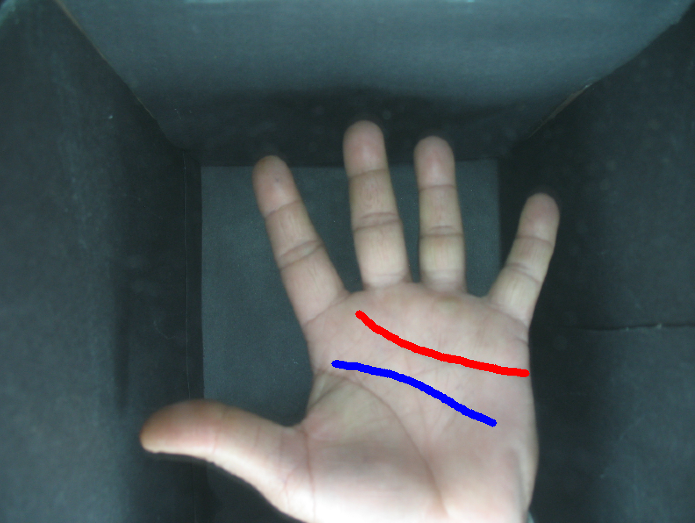
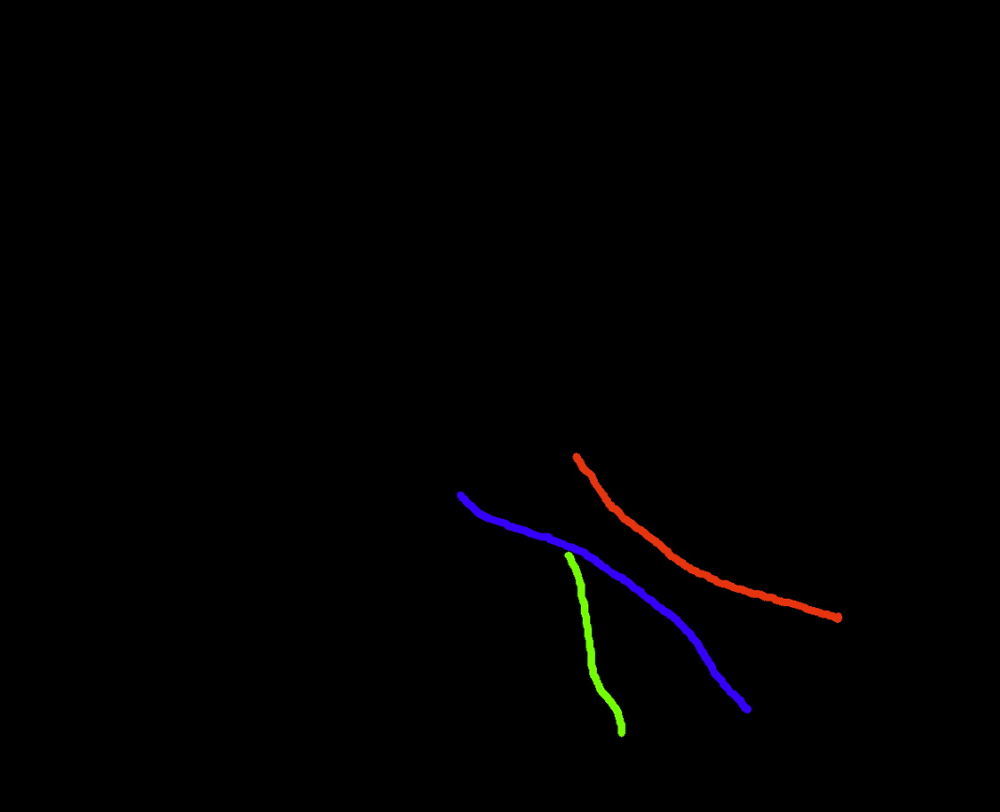

# Labeler
# Knuckle Labeling Tools

This repository contains two Python tools built with OpenCV to assist in manually labeling finger knuckle positions on hand images.

---

## 🖌️ 1. `Palm-labeler.py`

**Purpose:**  
Freehand draw 3 colored lines (Red, Blue, Green) on each image to annotate anatomical features like fingers, bones, or knuckles.

<table>
  <tr>
    <td align="center">
      
      <br>Line Drawing Tool
    </td>
    <td align="center">
      
      <br>Point Click Tool
    </td>
  </tr>
</table>

**How It Works:**
- Left-click and drag to draw lines.
- After drawing 3 lines, the overlay is saved as a PNG mask.
- Right-click also saves and manually advances to the next image.
- Images are resized for display, but saved outputs match original image resolution.
- Press 'Q' to quit

**Key Features:**
- 3-line color cycle (Red → Blue → Green)
- Outputs labeled images to a specified directory
- Easy navigation and annotation per image

---


## 🖱️ 2. `Knuckle-labeler.py`

**Purpose:**  
Click knuckle positions on hand images and save the coordinates in a JSON file.

**How It Works:**
- Left-click to place as many points as needed.
- Right-click saves the points for the current image and loads the next.
- Coordinates are stored relative to the original image size.

**Key Features:**
- Saves annotations in a structured JSON format:
  ```json
  {
    "115_1.JPG": [[x1, y1], [x2, y2], ..., [xn, yn]]
  }
